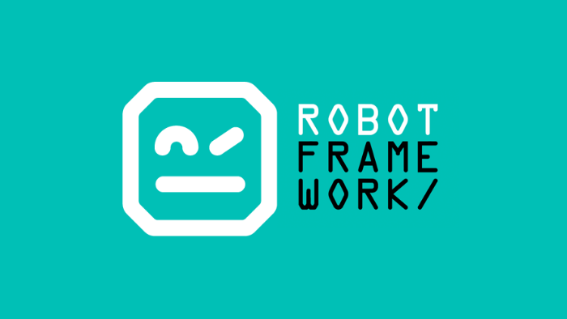

<p align="center">
  
</p>
<div align="center">

  <h1>Projeto - Teste de FrontEnd com Robot Framework</h1>
</div>

Este projeto tem como objetivo realizar testes de FrontEnd em uma aplicação web utilizando o SauceDemo como servidor de testes. O SauceDemo é uma plataforma online para práticas de testes.

## Ferramentas utilizadas:
- [Robot Framework](https://robotframework.org/robotframework/ "Robot Framework")

## Bibliotecas utilizadas:

- [Selenium Library](https://robotframework.org/SeleniumLibrary/SeleniumLibrary.html "Selenium Library")

## Pré-Requisitos
- Certifique-se de ter o Python instalado em sua máquina. Você pode baixá-lo [aqui](https://www.python.org/downloads/ "Python Download").
- Tenha uma IDE instalada (por exemplo, VS Code).

## Instalando o Robot Framework e Bibliotecas Relacionadas
Você pode instalar o Robot Framework e as bibliotecas necessárias executando os seguintes comandos no terminal ou prompt de comando:

```bash
pip install -r requirements.txt
```

## Executando os Testes
Execute os testes com o seguinte comando, substituindo `nome_do_arquivo.robot` pelo nome do arquivo que contém seus casos de teste:

```bash
robot nome_do_arquivo.robot
```
## Arquitetura
```
├── .github
│    └── workflows
│           └── develop.yml
├── logs
├── resources
│   ├── api
│   │   ├── keywords
│   │   │      └── api_post_user.resource
│   │   └── auth.robot
│   ├── data
│   │   ├── ambiente.yaml
│   │   └── login_admin.yaml
│   ├── keywords
│   │   ├── login_kws.resource
│   ├── pages
│   │   ├── login_page.robot
│   ├── shared
│   │   ├── utils_keywords.robot      
│   ├── utils
│   │    └── gerador_senha.py
│   └──── utils_keywords.robot
|── main.robot 
├── tests
|    ├── login.robot
├── readme.md
└── requirements.txt
```
